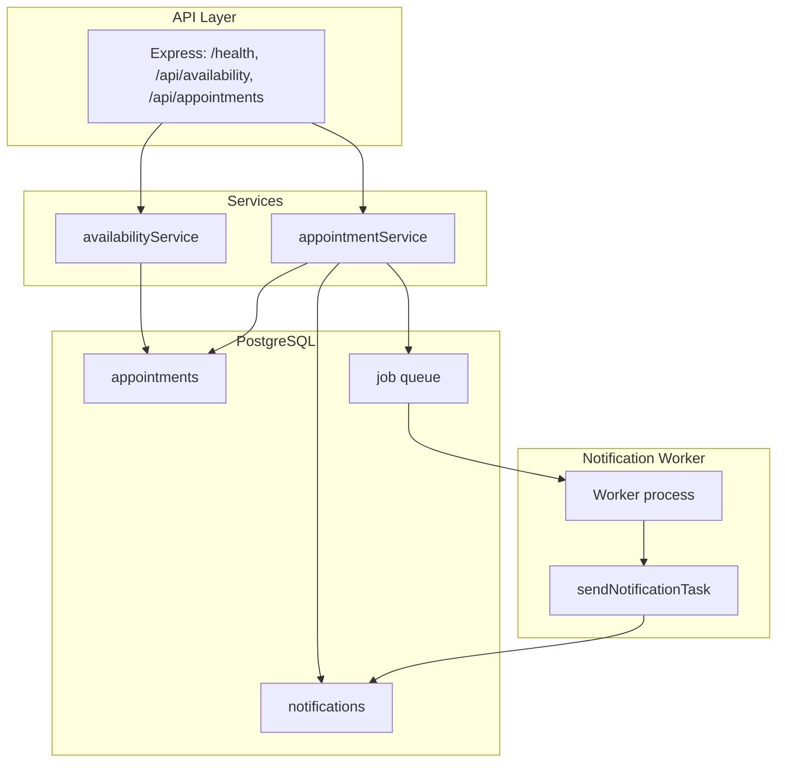

# Backend architecture

This document describes the backend architecture of the booking system: API layer, persistence, notification processing, and where consistency and idempotency are enforced.

**Flow in short:** HTTP hits the API → services read/write **appointments** and **notifications** and enqueue jobs → PostgreSQL stores data and the job queue. A separate **worker** process takes jobs from the queue and runs **sendNotificationTask**, which updates **notifications** (e.g. pending → sent).

## Booking consistency

- Enforced in the database by a partial unique index on `(slot_start, slot_end) WHERE status = 'booked'`. Only one booked row per slot is allowed; cancelled slots can be rebooked.
- The application runs insert, notification row creation, and job enqueue inside a single transaction. On unique violation (Postgres code `23505`), it throws `SlotAlreadyBookedError` and the API returns 409.

## Repeat-call safety

- Cancel is idempotent in `appointmentService.cancelAppointment` (apps/backend/src/services/appointmentService.ts): if the appointment is already cancelled, it returns the existing record; otherwise it updates once. Repeated `POST /api/appointments/:id/cancel` calls return the same result and do not error.
